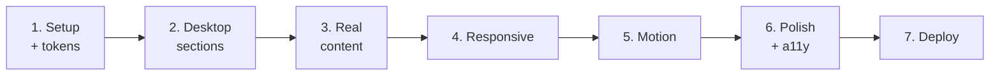

# Portfolio Build Spec — for Cursor

Sep 29, 2026 · @Vaigainathan

## Scope and stack

One static page built to match the Figma design exactly, deployed on Vercel. No CMS, no backend, no database.

| Choice | Decision | Why |
| --- | --- | --- |
| Framework | Next.js 16, App Router, TypeScript | Static export, best-in-class SEO and OG tags, Vercel deploy in one step |
| Styling | Tailwind CSS v4 with CSS custom properties | Tokens live in one place and can be swapped without touching components |
| Animation | GSAP + ScrollTrigger, Lenis for smooth scroll | Matches the agreed motion plan; no 3D, no WebGL |
| Images | `next/image`, AVIF/WebP, lazy below the fold | Screenshots are the heaviest assets on the page |
| Icons | Exported as SVG from Figma, inlined as React components | No icon library — the design's own icons only |
| Fonts | Self-hosted woff2, `font-display: swap` | Faster than Google Fonts CDN, no layout shift |
| Deploy | Vercel, `vaigainathan.vercel.app` first | Domain attached later without a rebuild |

**The rule for this build:** the Figma file is the source of truth. Pull exact values from it rather than eyeballing from screenshots. Where the design is silent (mobile layouts, hover and focus states), follow the responsive and motion sections below — do not invent anything else.

## Figma node map

File key: `FYNbpUm63ZN9BRmXRYnwbj`. Page: `0:1`. Root frame: `9:2` (1280 × 6487).

Use the Figma MCP in Cursor and call `get_design_context` on one node at a time, in this order. Never pull the whole file at once — it returns too much and the output gets truncated.

| Order | Section | Node ID | Notes |
| --- | --- | --- | --- |
| 1 | Header (sticky nav) | `9:435` | Logo dot, 4 nav links, CTA button |
| 2 | Hero | `9:4` | Availability pill, headline, subline, 2 CTAs, 3 proof cards |
| 3 | What I build | `9:75` | Section label, heading, 3 capability cards with tag chips |
| 4 | E-Pickup case study | `9:141` | Header, 3 metric cards, device showcase, testimonial card |
| 5 | Selected client work | `9:224` | 2 alternating project blocks + archive list |
| 6 | Process | `9:311` | 4-step numbered timeline |
| 7 | About | `9:362` | Label, heading, pull quote, 2 paragraphs, status pill |
| 8 | Contact CTA | `9:379` | Heading, copy, WhatsApp + email buttons, 3 reassurance columns |
| 9 | Footer | `9:417` | Name, tagline, links row |

**Sub-nodes worth pulling separately** when a parent returns too much: hero proof cards `9:28`, capability cards `9:84` / `9:103` / `9:122`, E-Pickup metrics `9:154`, device showcase `9:176`, testimonial `9:212`, project blocks `9:231` / `9:257`, archive list `9:283`.

Export icons with `download_assets` — every icon in the design is a vector node, no icon library needed.

## Design tokens

The Figma file defines no variables or shared styles — every colour and text style is set directly on its layers. So the first build task is to extract them once and centralise them, before any component is written.

**How to extract**

1. Run `get_design_context` on the header, hero and E-Pickup nodes.
2. Collect every distinct colour, font size, weight, line height, letter spacing, radius and spacing value from the returned code.
3. Write them into `app/globals.css` as CSS custom properties under `:root`.
4. From then on, components reference tokens only — no raw hex values anywhere in component files.

**Token groups to create**

- `--bg` page ground, `--surface` card background, `--surface-2` raised card, `--border` hairlines
- `--text` primary, `--text-muted` secondary, `--text-dim` tertiary
- `--accent-gold` (section labels, metric numbers), `--accent-teal` (status dots, live indicators), `--accent-action` (WhatsApp button)
- `--font-display`, `--font-body`, `--font-mono`
- Radius and spacing scales, taken from the design rather than assumed

**The three-accent rule** — the design uses gold, teal and a bright action green. Since nothing in the file defines when each applies, fix it here and keep it consistent:

- **Gold** — section labels, metric numbers, step numbers
- **Teal** — live/status indicators only (availability dot, "Online", "Telemetry Active")
- **Action green** — the WhatsApp button, nowhere else

**Dark mode note:** the ground is a near-black and the primary text is an off-white, not pure `#000` / `#fff`. Keep whatever the file actually specifies — do not round these to pure values.

## Project structure

All copy and project data lives in typed content files, separate from components — so text can be corrected without touching layout.

```
app/
  layout.tsx          fonts, metadata, OG tags
  page.tsx            imports all sections in order
  globals.css         tokens, base styles, reduced-motion block
components/
  sections/           Header, Hero, Capabilities, CaseStudy,
                      ClientWork, Process, About, Contact, Footer
  ui/                 Pill, MetricCard, TagChip, DeviceFrame,
                      TestimonialCard, ProjectBlock, SectionLabel
  motion/             Reveal, Parallax, SmoothScroll
content/
  site.ts             name, nav, WhatsApp, email, socials
  capabilities.ts     3 service cards
  projects.ts         E-Pickup, NestaIra, V3, archive items
  testimonials.ts     approved client quotes only
lib/
  motion.ts           GSAP setup, shared easing and durations
public/
  images/  fonts/  icons/
```

**Content model for a project**

```csv
field,example,notes
slug,e-pickup,used for anchors
name,E-Pickup,display name
category,Logistics · Tirupattur,small label above the title
summary,one-sentence description,shown in the card
role,Design & development,role tag
stack,"React Native, Node.js, Firebase",array of strings
built,"Customer app, Driver app, Admin dashboard",array of strings
liveUrl,https://...,omit if none
images,array of {src, alt, caption},device frames
testimonial,ref to testimonials.ts,optional
```

**Rules**

- Every metric, label and sentence comes from `content/`, never hardcoded in a component.
- Every image needs real alt text describing what the screen shows.
- A project with no `liveUrl` renders without a link rather than a dead one.

## Build order

Seven phases. Structure and content first, motion last — motion added to a shifting layout gets rebuilt twice.



**1. Setup and tokens** — Next.js + Tailwind + TypeScript scaffold, fonts self-hosted, all tokens extracted from Figma into `globals.css`. Done when a test page renders every token correctly.

**2. Desktop sections** — build all nine sections at 1280px, pixel-accurate to Figma, using placeholder content. Done when a side-by-side against the Figma frame shows no spacing or type differences.

**3. Real content** — swap placeholders for the real copy, screenshots, links and approved testimonials. Done when nothing on the page is invented or borrowed from the mockups.

**4. Responsive** — apply the rules in the next section. Done when the page works at 390, 768 and 1280 with no horizontal scroll at any width.

**5. Motion** — Lenis, then GSAP reveals, then the E-Pickup parallax. Done when reduced-motion is honoured and scrolling stays smooth on a mid-range Android.

**6. Polish and accessibility** — focus states, hover states, alt text, contrast checks, Lighthouse pass.

**7. Deploy** — Vercel, OG image, analytics, real-device test before sharing the link anywhere.

**Check after every phase:** the page must still work with JavaScript disabled — all content visible, nothing hidden behind an animation that never runs.

## Responsive rules

The Figma file has only a 1280px frame, so these rules fill the gap. Most visitors arrive from a WhatsApp link on a phone — mobile is the primary case, not an afterthought.

Breakpoints: **390** (phone), **768** (tablet), **1280** (desktop, matches Figma).

| Section | Tablet (768) | Phone (390) |
| --- | --- | --- |
| Header | Same, tighter spacing | Logo + hamburger; full-screen menu; WhatsApp icon stays visible |
| Hero | Headline \~56px | Headline \~40px, left-aligned; CTAs full-width stacked |
| Hero proof cards | 3 across, narrower | Stack to 1 column, or horizontal swipe strip |
| Capabilities | 2 columns, third wraps | 1 column, full-width cards |
| E-Pickup metrics | 3 across | 1 column stacked |
| Device showcase | Dashboard on top, phones below | Dashboard full-width; phones side-by-side in a swipe strip, never shrunk below readable |
| Testimonial | Same, tighter padding | Quote \~18px, attribution stacks under it |
| Project blocks | Image on top, text below | Same, stacked; image keeps aspect ratio |
| Archive list | Same | Name and description stack; tags and link on one row below |
| Process | 2 × 2 grid | 1 column, numbers stay visible |
| About | Same, narrower | Pull quote \~20px |
| Contact | Text on top, buttons below | Buttons full-width; WhatsApp first; reassurance columns stack |
| Footer | Same | Links wrap to two rows |

**Non-negotiables**

- No horizontal page scroll at any width. Swipe strips scroll inside their own container only.
- 16px minimum side gutter on phone.
- Tap targets at least 44 × 44px.
- Nothing important behind hover only — archive thumbnails either show on mobile or are dropped there.
- A sticky WhatsApp button on phone, appearing after the hero scrolls past.
- Type scales down but never below 15px for body copy.

**Check on a real mid-range Android over mobile data, not just a browser resize.**

## Motion spec

Motion reveals content; it never decorates. Nothing bounces, spins or loops. If an animation does not help the page read, it does not ship.

**Global**

- Lenis smooth scroll, duration \~1.1s, gentle easing. Disabled on touch devices where it fights native scrolling.
- Shared values: duration 0.6–0.8s, easing `power3.out`, stagger 0.08s.
- Every reveal fires once (`once: true`), triggered around 85% viewport.

**Per section**

| Section | Animation |
| --- | --- |
| Header | Transparent at top; background and bottom border fade in after \~80px of scroll |
| Hero headline | Two lines reveal from below behind a mask, on load, staggered |
| Hero subline + CTAs | Fade up 20px, after the headline |
| Proof cards | Fade up, staggered left to right |
| Capability cards | Fade up, staggered; border brightens on hover |
| E-Pickup metrics | Fade up staggered; numbers count up once, ending on the real value |
| Device showcase | The one standout moment — dashboard and the two phones move at slightly different speeds through the scroll, roughly 40px of offset. Disabled on phone. |
| Testimonial | Simple fade up |
| Project blocks | Text and image fade up together; image scales from 1.02 to 1 |
| Archive rows | Row background brightens on hover, thumbnail fades in (desktop only) |
| Process steps | Staggered fade up; connecting line draws left to right |
| About | Pull quote fades up first, paragraphs after |
| Contact | Panel fades up; WhatsApp button is magnetic on desktop, plain tap target on phone |

**Reduced motion** — inside `prefers-reduced-motion: reduce`: kill Lenis, kill ScrollTrigger animations, kill the count-up (show final numbers immediately), kill the parallax. Content renders in its final state. This is a requirement, not a nice-to-have.

**Performance rule** — animate `transform` and `opacity` only. Never animate width, height, top or left.

## Performance, accessibility, SEO

The site is itself a work sample — a slow or broken portfolio undercuts everything it claims. Treat these as acceptance criteria, not aspirations.

**Performance targets**

- Lighthouse mobile: 90+ performance, 100 accessibility, 100 best practices, 100 SEO
- Largest Contentful Paint under 2.5s on a simulated 4G connection
- Cumulative Layout Shift under 0.1 — reserve space for every image and self-host fonts
- Total page weight under 2MB; screenshots are the risk, so compress and serve AVIF/WebP with `sizes` set
- Only the hero is eager-loaded; everything below the fold is lazy

**Accessibility**

- Every interactive element has a visible focus ring that meets contrast on the dark ground
- Logical heading order: one `h1` (the hero), `h2` per section, `h3` for cards
- Body text at 4.5:1 contrast minimum; check the grey "Built to last." line and the dim tertiary text
- Real alt text on every screenshot, describing the screen rather than repeating the project name
- Full keyboard navigation, including the mobile menu; `aria-expanded` on the toggle
- `aria-label` on icon-only buttons

**SEO and sharing**

- Title: `Vaigainathan — Web & Mobile App Developer`
- Meta description mentioning websites, mobile apps, WhatsApp and CRM integration, and Bengaluru
- A real OG image, 1200 × 630, showing the name and what he does — this is what appears when the link is pasted into WhatsApp or a community, so it matters more than most SEO work
- `Person` structured data with name, role, location and social links
- `sitemap.xml` and `robots.txt`
- Canonical URL set, and updated when the custom domain is attached

## What to supply before phase 3

Phases 1 and 2 can start now with placeholders. Phase 3 is blocked until these exist. Everything currently in the Figma file is mockup content and none of it ships.

**Screenshots**

- [ ] E-Pickup admin dashboard — 1 wide shot, real data, anything private blurred
- [ ] E-Pickup customer app — 2–3 screens (booking, live tracking, confirmation) in ₹, not $ or £
- [ ] E-Pickup delivery partner app — 2 screens (job request, active route) in ₹
- [ ] E-Pickup merchant app — 1 screen or design mock, labelled in progress
- [ ] NestaIra Trails — desktop home screenshot
- [ ] V3 Agritech — desktop home or catalogue screenshot
- [ ] Radcam Technologies — desktop screenshot
- [ ] Deepanjan Cables — desktop screenshot, once on its real domain

**Corrected numbers and claims**

- [ ] Is it 200+ customers or 200+ daily active users? The site must state whichever is true
- [ ] Replace "zero downtime", "zero telemetry failures", "zero data errors" with claims that hold up
- [ ] Android only, or iOS too? Drop "App Store launch" if nothing has shipped there
- [ ] Decide the solo-versus-team story, and keep it consistent between the metric card and the About section

**Text and contact**

- [ ] Client-approved testimonial wording and correct titles for Bhoopathy, Vinod and Vinayak
- [ ] Permission from Brand Escalators Media to show Radcam and Deepanjan
- [ ] WhatsApp number in international format, for the `wa.me` link
- [ ] Real email address, replacing the placeholder in the design
- [ ] GitHub and LinkedIn URLs

**From the designer**

- [ ] Mobile frames, if she has time — otherwise the responsive rules above stand as the spec
- [ ] Fix the email button's two-line wrap in the contact section
